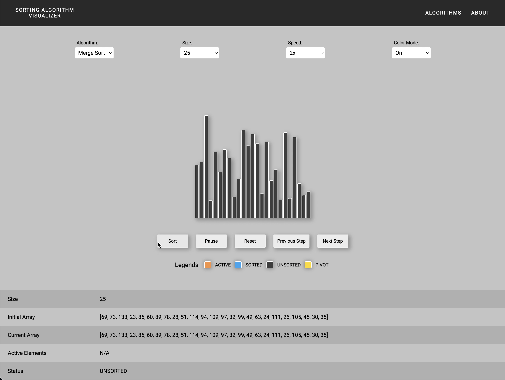

# Sorting Algorithm Visualizer

This project was part of my thesis work. It is a visualizer application made with React to visualize the workings of different sorting algorithms.

---

---

### Tech stack:
- React 
- TypeScript 
- Redux 
- React-Router 
- SASS 
- Babel 
- Webpack 
- Eslint

### To run the project locally, clone the project and run:

### `npm start` or `yarn start` or `pnpm start`

@bkrmdtya 2021